 

***I plan before I build — every project starts with a spec, not a blank editor. Right now that means two products in active development for the African SaaS market, plus three earlier tools that shipped, work, and no longer need my daily attention.***

## Currently shipped

|  |  |
|---|---|
| **[Acadex](https://acadex-ed.vercel.app/)** | Multi-tenant school management SaaS, built for the Uganda education market first |
| **[RestaurantOS](https://restaurant-os-ug.vercel.app/)** | Restaurant management platform — ordering, ops, and staff workflows in one system |

## Shipped, in maintenance

|  |  |
|---|---|
| **Nextract** | A clean, local-first media extraction and downloading app. |
| **Calcli** | A scriptable calculator with styled terminal output and an interactive TUI. |
| **Transmoji** | A client-side only, bidirectional text ↔ emoji translator web app. |

## Stack

          

## Connect

 

## GitHub Stats

  
  

 

  

